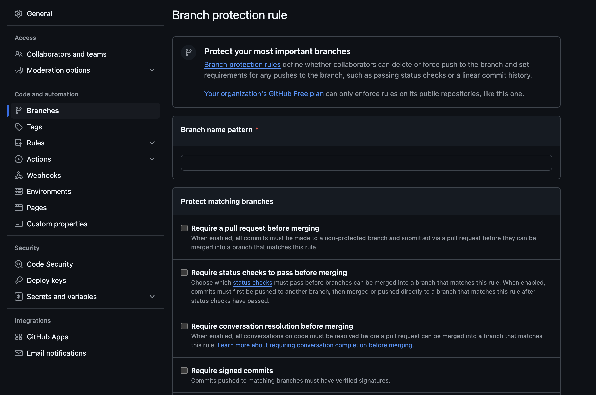

# Branches

<figure markdown>
    <div align="center">
        
        <figcaption>Branches settings page</figcaption>
    </div>
</figure>

## Example configuration

```yaml
branches:
  - name: develop
    protection:
      required_pull_request_reviews:
        required_approving_review_count: 1
```
