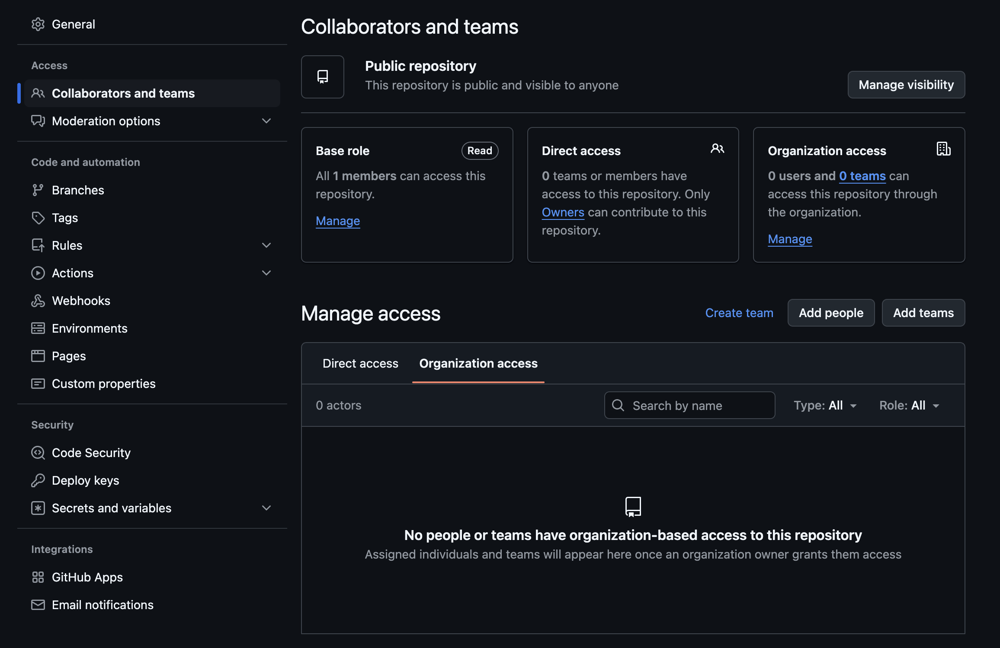

# Collaborators

<figure markdown>
    <div align="center">
        
        <figcaption>Collaborators settings page</figcaption>
    </div>
</figure>

## Example configuration

```yaml
collaborator:
  - username: torvalds
    permission: admin
```
