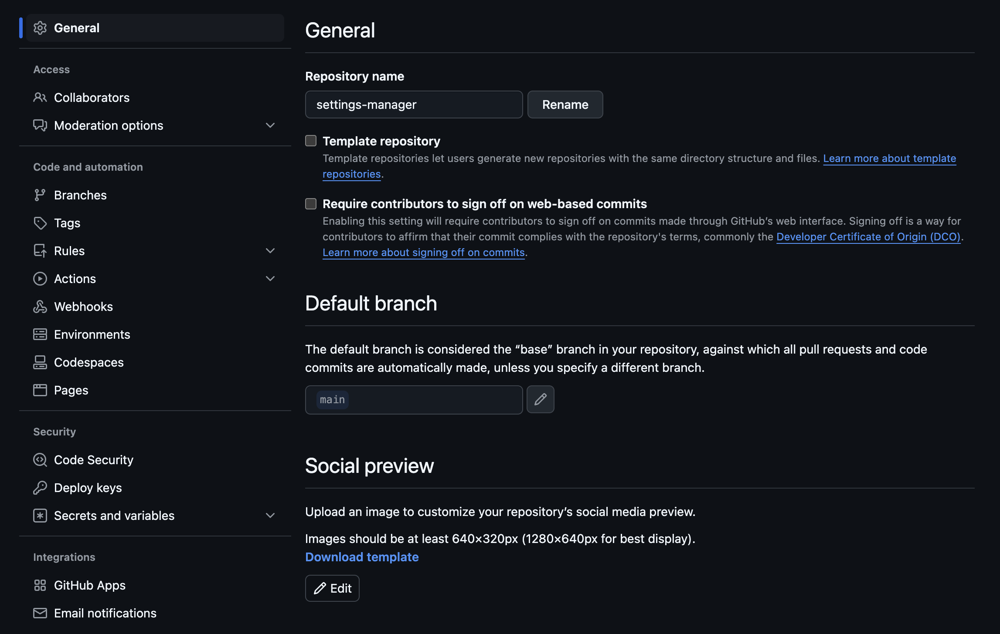

# General

<figure markdown>
    <div align="center">
        
        <figcaption>General settings page</a></figcaption>
    </div>
</figure>

## description

Short description of the repository.

Example:
```yaml
general:
  description: Repository description goes here
```

## homepage

URL with more information about the repository.

Example:
```yaml
general:
  homepage: https://example.com
```

## private

Either `true` to make the repository private or `false` to make it public.

Example:
```yaml
general:
  private: false
```

## security\_and\_analysis

Specify which security and analysis features to enable or disable for the
repository.

Example:
```yaml
general:
  security_and_analysis:
    advanced_security:
      status: enabled
    code_security:
      status: enabled
    secret_scanning:
      status: enabled
    secret_scanning_push_protection:
      status: disabled
    secret_scanning_ai_detection: 
      status: disabled
    secret_scanning_non_provider_patterns:
      status: disabled
```

## has\_issues

Either `true` to enable issues for this repository or `false` to disable them.

Example:
```yaml
general:
  has_issues: false
```

## has\_projects

Either `true` to enable projects for this repository or `false` to disable
them.

Example:
```yaml
general:
  has_projects: false
```

## has\_wiki

Either `true` to enable the wiki for this repository or `false` to disable
it.

Example:
```yaml
general:
  has_wiki: false
```

## is\_template

Either true to make this repo available as a template repository or false to
prevent it.

Example:
```yaml
general:
  is_template: true
```

## default\_branch

Updates the default branch for this repository.

Example:
```yaml
general:
  default_branch: develop
```

## allow\_squash\_merge

Either `true` to allow squash-merging pull requests, or `false` to prevent
squash-merging.

Example:
```yaml
general:
  allow_squash_merge: true
```

## allow\_merge\_commit

Either `true` to allow merging pull requests with a merge commit, or `false` to
prevent merging pull requests with merge commits.

Example:
```yaml
general:
  allow_merge_commit: false
```

## allow\_rebase\_merge

Either `true` to allow rebase-merging pull requests, or `false` to prevent
rebase-merging.

Example:
```yaml
general:
  allow_rebase_merge: false
```

## allow\_auto\_merge

Either `true` to allow auto-merge on pull requests, or `false` to disallow
auto-merge.

Example:
```yaml
general:
  allow_auto_merge: true
```

## delete\_branch\_on\_merge

Either `true` to allow automatically deleting head branches when pull requests
are merged, or `false` to prevent automatic deletion.

Example:
```yaml
general:
  delete_branch_on_merge: true
```

## allow\_update\_branch

Either `true` to always allow a pull request head branch that is behind its
base branch to be updated even if it is not required to be up to date before
merging, or `false` otherwise.

Example:
```yaml
general:
  allow_update_branch: true
```

## squash\_merge\_commit\_title

Required when using squash\_merge\_commit\_message.

The default value for a squash merge commit title:

- **PR_TITLE**: default to the pull request's title.
- **COMMIT_OR_PR_TITLE**: default to the commit's title (if only one commit) or the pull request's title (when more than one commit).

```yaml
general:
  squash_merge_commit_title: PR_TITLE
```

## squash\_merge\_commit\_message

The default value for a squash merge commit message:

- **PR_BODY**: default to the pull request's body.
- **COMMIT_MESSAGES**: default to the branch's commit messages.
- **BLANK**: default to a blank commit message.

```yaml
general:
  squash_merge_commit_message: PR_BODY
```

## merge\_commit\_title

Required when using merge\_commit\_message.

The default value for a merge commit title.

- **PR_TITLE**: default to the pull request's title.
- **MERGE_MESSAGE**: default to the classic title for a merge message (e.g., Merge pull request #123 from branch-name).

```yaml
general:
  merge_commit_title: PR_TITLE
```

## merge\_commit\_message

The default value for a merge commit message.

- **PR_TITLE**: default to the pull request's title.
- **PR_BODY**: default to the pull request's body.
- **BLANK**: default to a blank commit message.

```yaml
general:
  merge_commit_message: PR_BODY
```

## archived

Whether to archive this repository. `false` will unarchive a previously
archived repository.

```yaml
general:
  archived: true
```

## allow\_forking

Either `true` to allow private forks, or `false` to prevent private forks.

```yaml
general:
  allow_forking: false
```

## web\_commit\_signoff\_required

Either `true` to require contributors to sign off on web-based commits, or
`false` to not require contributors to sign off on web-based commits.

```yaml
general:
  web_commit_signoff_required: true
```
