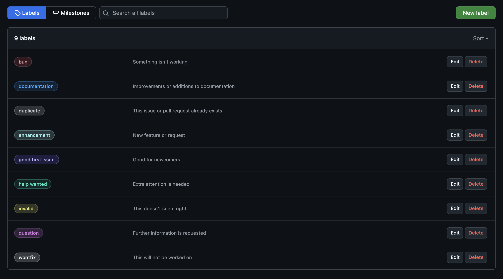

# Labels

<figure markdown>
    <div align="center">
        
        <figcaption>Labels settings page</figcaption>
    </div>
</figure>

## Add new label

Example:
```yaml
labels:
  - name: My label
    description: My label description goes here
    color: 00ff00
```
