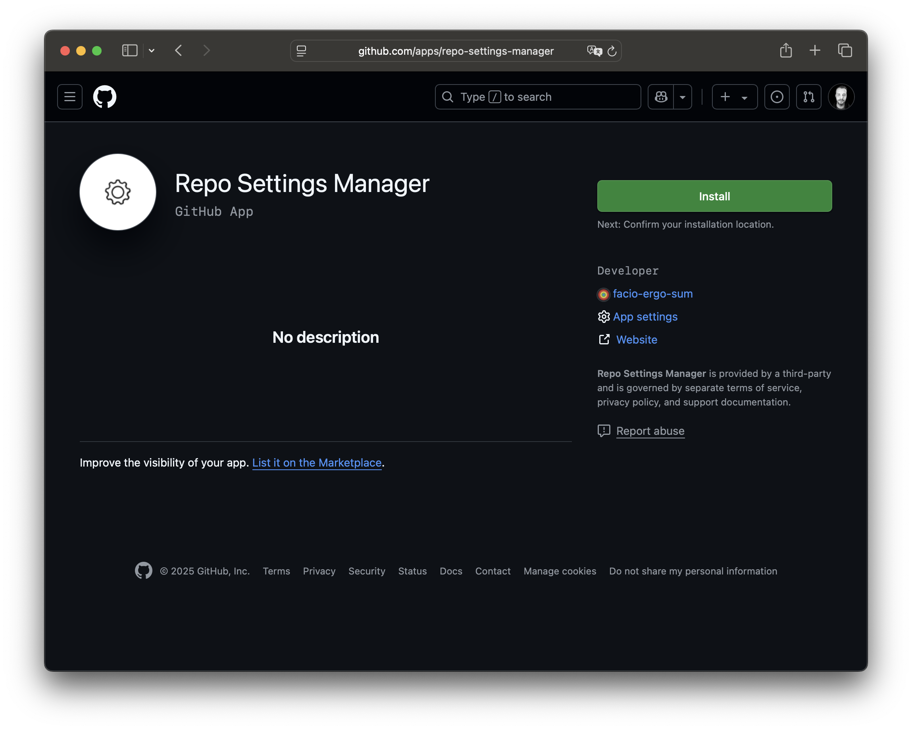

# Getting Started

1. Navigate to [https://github.com/apps/repo-settings-manager](https://github.com/apps/repo-settings-manager)

<figure markdown>
    

        
        <figcaption>Install GitHub App page</figcaption>
    

</figure>
